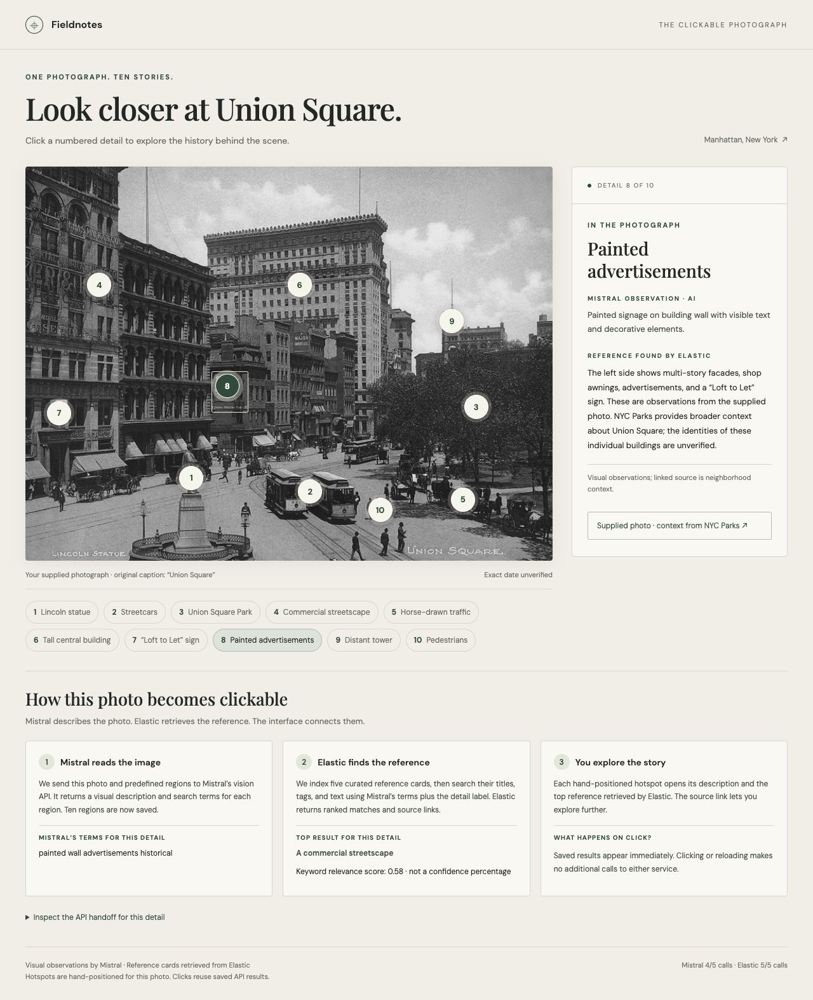

# hack

## Clickable photo proof of concept

Requires Python 3.9 or newer. Copy `.env.example` to `.env` and fill in your
Mistral and Elasticsearch credentials before the first run.

```sh
python3 photo_poc.py
```

Open <http://127.0.0.1:8765>. The demo uses only the supplied Union Square photo
in `static/photo.jpg`; there is no upload feature. Click a numbered hotspot or
its label to see a Mistral observation and an Elastic-retrieved reference card.

To serve on this computer's network IP:

```sh
python3 photo_poc.py --host YOUR_INTERFACE_IP
```

Open `http://YOUR_INTERFACE_IP:8765` from a device that can reach that IP.



The first load performs **one Mistral API call** to annotate ten manually
positioned regions, **one Elastic bulk API call** to seed a five-record reference
catalog, and **one Elastic multi-search API call** to search that catalog using
Mistral's queries. No embeddings or framework dependencies are needed.

The ten points include the original five plus the tall central building,
“Loft to Let” sign, painted advertisements, distant tower, and pedestrians.
Expanding the saved demo from five to ten used one additional Mistral call and
one Elastic multi-search call. Existing descriptions and matches were reused,
and the five-card reference catalog supplies broad context for the new points.

The backend reads the existing `.env` keys. `MISTRAL_VISION_MODEL` optionally
overrides the default `mistral-medium-2508`. Keys stay on the backend.
The Elastic key needs write/create-index and read access to
`clickable-union-square-poc-v1`. The demo binds to localhost by default;
`--host` selects a specific network interface.

**At most five HTTP API attempts per service** are allowed by this demo.
Counters, intermediate progress, and final results persist in the ignored
`.photo-poc-state.json`; restarting and clicking hotspots do not reset them.
Each attempted provider request, including a timeout or failure, counts.
There are no automatic retries. A manual retry resumes unfinished work using
the remaining budget. Preserve the state file to preserve this cap. Other
scripts, including the hello-world script below, are outside this counter.

The regions are hand-positioned, not automatically detected. Historical cards
come from a small curated catalog with links to NYC Parks and the New York
Transit Museum; some cards provide general context rather than exact object
identification. The photograph's date, building identities, and transit routes
are not established. Once prepared, the photo and API results remain local;
initial annotation sends the supplied photo to Mistral.

Visual QA corrected Mistral's description of the statue's pose and enclosure.
That card is marked “reviewed”; its original model text is preserved as
`model_observation`. Other model descriptions remain AI observations.

Offline verification (does not call either service):

```sh
python3 -m unittest -v test_photo_poc.py
```

## Elasticsearch hello world

Run the Elasticsearch hello world with Python 3.9 or newer (no packages needed):

```sh
python3 hello_elasticsearch.py
```

The script reads `ELASTICSEARCH_URL` and `ELASTICSEARCH_API_KEY` from the ignored
`.env` file. Environment variables can override these values.

Each run creates a document containing `{"message": "Hello, world!"}` in the
`hello-world` index, then searches for it and verifies the result. Documents stay
in Elasticsearch, and each run uses a fresh document ID.

The write uses [`refresh=wait_for`](https://www.elastic.co/docs/reference/elasticsearch/rest-apis/refresh-parameter)
so the document is searchable before verification.
